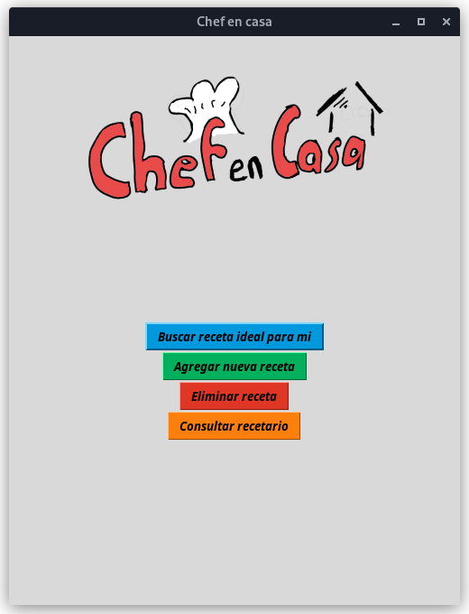
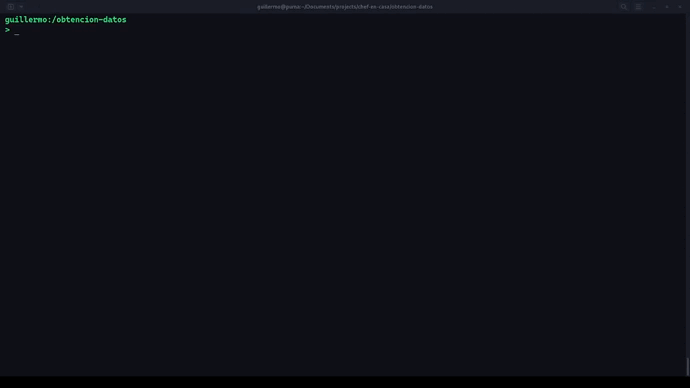
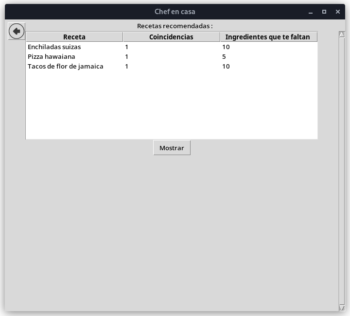

# Chef en casa

Aplicación de recomendaciones de recetas según tus ingredientes.

## Obtencion de los datos
Utilizando tećnicas de web scraping se obtuvo la informacion del las recetas a traves del sitio https://recetas-mexicanas.com.mx/, se guardo la informacion en MongoDB dado que las recetas no tiene un esquema fijo, dado que puede tener varios ingredientes y son extraidos en un formato json.

## Diseño algoritmico

El núcleo de la aplicación es que busca la receta ideal, dependiendo de los
ingredientes del cliente. Dado que existe millones de recetas en el mundo
tratamos de reducir el espacio, con nuestras recetas que existen en nuestras
base de datos. Cualquier otro usuario puede contribuir con las recetas y
con ello poder extender nuestro recetario.

La aplicación buscara de todas las recetas de nuestra base de datos la que
tenga mayor coincidencia con nuestros ingredientes, dado que la mejor
receta ideal para nosotros es la receta que contendrá los mismos
ingredientes que contenga el usuario, cabe la posibilidad que que no
encuentra la coincidencia exacta, es decir, que le falte algunos
ingredientes para acabar la receta, en ese caso, le recomendamos esa receta para que el usuario pueda decidir si comprar los productos que falta para
completar la receta.

## Installation

Debe de instalar tkinter previamente
~~~
# En linux
sudo dnf install python3-tkinter
~~~

## Usage 
Una vez instalado tkinter ejecutar:
~~~
cd src/
python menuUI.py
~~~